<h2 align="center">
  
</h2>
<h2 align="center">
Visualization and Qualitatively Analysis of Baseline Models 
</h2>

We provide some visualization videos and qualitatively analysis for baseline methods on Bench2Drive.For TCP, UniAD and VAD, we choose the best version of these models(TCP-traj,UniAD-Base,VAD-Base), and make visualization on 10 Scenarios as below. 

**Note: It might take some time to load all gifs. Please be patient.**

<table>
  <tr>
    <th rowspan="2" style="text-align:center">  Driving Skill </th> <th rowspan="2" style="text-align:center"> Scenario Name </th> <th rowspan="2" style="text-align:center"> Route ID </th><th colspan="4" style="text-align:center"> Success </th> 
  </tr>
  <tr>
    <td> AD-MLP </td> <td> TCP-traj </td><td>UniAD-Base</td><td>VAD-Base</td>
  </tr>

  <tr>
    <td rowspan="2" style="text-align:center">Merging</td>
    <td>MergerIntoSlowTraffic</td> 
    <td>2283</td> 
    <td>x</td><td>√</td><td>√</td><td>x</td>
  </tr>
  <tr>
    <td>SignalizedJunctionLeftTurn</td>
    <td>4183</td>
    <td>x</td><td>√</td><td>x</td><td>√</td>
  </tr>
  <tr>
    <td rowspan="2" style="text-align:center">Overtaking</td>
    <td>ParkedObstacle</td> 
    <td>25318</td> 
    <td>x</td><td>x</td><td>x</td><td>√</td>
  </tr>
  <tr>
    <td>HazardAtSideLane</td>
    <td>25439</td>
    <td>x</td><td>x</td><td>√</td><td>√</td>
  </tr>
  <tr>
    <td rowspan="2" style="text-align:center">Emergency Brake</td>
    <td>ParkingCutIn</td> 
    <td>18305</td> 
    <td>x</td><td>√</td><td>√</td><td>x</td>
  </tr>
  <tr>
    <td>StaticCutIn</td>
    <td>26396</td>
    <td>x</td><td>x</td><td>√</td><td>√</td>
  </tr>
  <tr>
    <td rowspan="2" style="text-align:center">Give Way</td>
    <td>YieldToEmergencyVehicle</td> 
    <td>3378</td> 
    <td>x</td><td>x</td><td>x</td><td>x</td>
  </tr>
  <tr>
    <td>InvadingTurn</td> 
    <td>2802</td> 
    <td>x</td><td>√</td><td>√</td><td>x</td>
  </tr>
  <tr>
    <td rowspan="2" style="text-align:center">Traffic Sign</td>
    <td>EnterActorFlow</td> 
    <td>3749</td> 
    <td>x</td><td>√</td><td>x</td><td>x</td>
  </tr>
  <tr>
    <td>VanillaNonSignalizedTurnEncounterStopsign</td>
    <td>3905</td>
    <td>x</td><td>√</td><td>x</td><td>x</td>
  </tr>
</table>

**Note: In this visualization, the definition of 'success' differs from the standard definition used in the Bench2Drive**. A route may involve multiple actions, such as turning after passing through a traffic light. In this visualization, we only evaluate whether the selected segment's action is successful. For example, if the vehicle obeys the traffic light and passes through the intersection, but collides while turning, it is still considered a successful case in following traffic sign.

# Merging
we visualize the behavior of three models on `MergeIntoSlowTraffic` and `SignalizedJunctionLeftTurn` scenarios to show their ability of mering . The ego vehicle should drive to off-ramp to exit the highway in `MergeIntoSlowTraffic`, and it should perform a left turn in `SignalizedJunctionLeftTurn`.

<table>
  <tr>
    <th> Case ID </th> <th> Models </th> <th> Scenario </th><th>&nbsp;&nbsp;&nbsp;&nbsp;&nbsp;&nbsp;&nbsp;&nbsp;&nbsp;&nbsp;&nbsp;&nbsp;&nbsp;Front&nbsp;Camera&nbsp;&nbsp;&nbsp;&nbsp;&nbsp;&nbsp;&nbsp;&nbsp;&nbsp;&nbsp;&nbsp;&nbsp;&nbsp;</th><th>&nbsp;&nbsp;&nbsp;&nbsp;BEV&nbsp;&nbsp;&nbsp;&nbsp;</th><th>Success</th><th>Qualitatively Analysis</th>
  </tr>
  <tr>
    <td> 1 </td> <td> TCP-traj </td> <td>MergeInto SlowTraffic</td><td>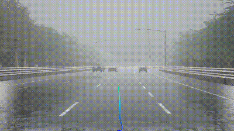</td><td>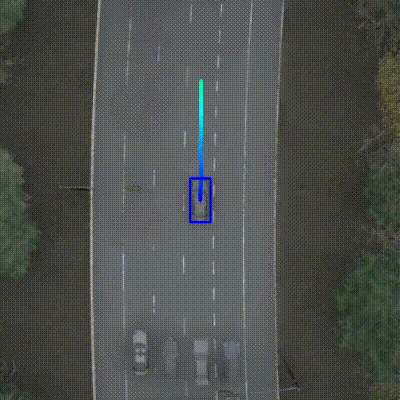</td> <td> √ </td><td> The ego vehicle carefully changes the lane and exits highway successfully, but at a quite low speed (the video is at x2 speed).</td>
  </tr>  <tr>
    <td> 2 </td><td>  UniAD-Base </td> <td>MergeInto SlowTraffic</td><td>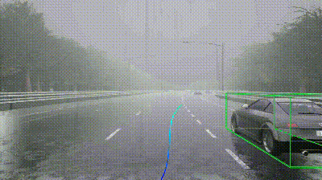</td><td>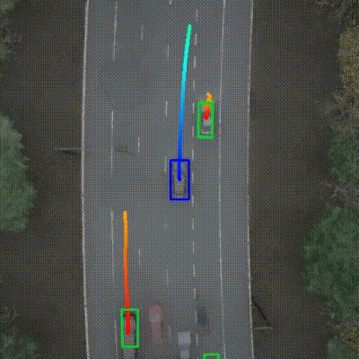</td><td> √ </td><td> The ego vehicle makes a lane change at a high speed, exits highway successfully.</td>
  </tr>
  <tr>
    <td> 3 </td><td>  VAD-Base </td> <td>MergeInto SlowTraffic</td><td>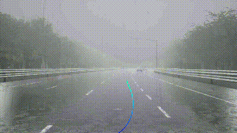</td><td>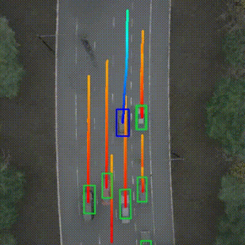</td><td> x </td><td> The ego vehicle detects the car at front right, but still drives too fast and crashes into it.</td>
  </tr>
  <tr>
    <td> 4 </td><td>  TCP-traj </td> <td>Signalized Junction LeftTurn</td><td>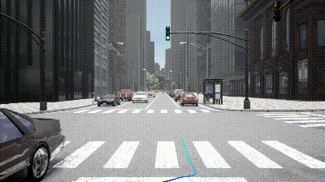</td><td></td> <td> √ </td><td> The ego vehicle predicts appropriate trajectory and turns left at junction successfully.</td>
  </tr>  <tr>
    <td> 5 </td><td>  UniAD-Base </td> <td>Signalized Junction LeftTurn</td><td>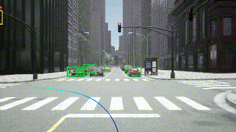</td><td></td><td> x </td><td> The ego vehicle fails to detect the car coming in opposite direction and continues to drive ahead, results in crash.</td>
  </tr>
  <tr>
    <td> 6 </td><td>  VAD-Base </td> <td>Signalized Junction LeftTurn</td><td>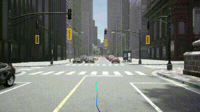</td><td>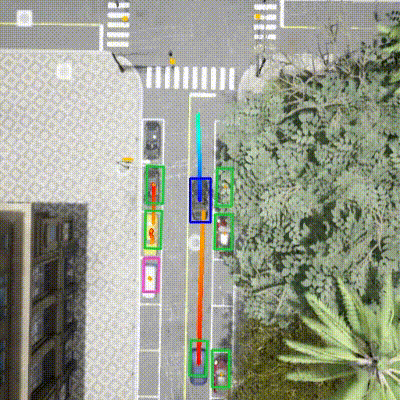</td><td> √ </td><td> The ego vehicle detects and predicts motions of nearby vehicles, and makes left turn smoothly.</td>
  </tr>

</table>

# Overtaking

We visualize the behavior of three models on `ParkedObstacle` and `HazardAtSideLane` scenarios to show their ability of overtaking. The ego vehicle encounters a parked vehicle blocking part of the lane in `ParkedObstacle`, and encounters a slow-moving hazard blocking part of the lane in `HazardAtSideLane`.It should perform a lane change to avoid it.

<table>
  <tr>
    <th> Case ID </th><th> Models </th> <th> Scenario </th><th>&nbsp;&nbsp;&nbsp;&nbsp;&nbsp;&nbsp;&nbsp;&nbsp;&nbsp;&nbsp;&nbsp;&nbsp;&nbsp;Front&nbsp;Camera&nbsp;&nbsp;&nbsp;&nbsp;&nbsp;&nbsp;&nbsp;&nbsp;&nbsp;&nbsp;&nbsp;&nbsp;&nbsp;</th><th>&nbsp;&nbsp;&nbsp;&nbsp;&nbsp;BEV&nbsp;&nbsp;&nbsp;&nbsp;&nbsp;&nbsp;</th><th>Success</th><th>Qualitatively Analysis</th>
  </tr>
  <tr>
    <td> 7 </td><td> TCP-traj </td> <td>ParkedObstacle</td><td>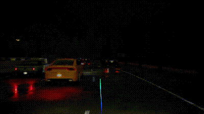</td><td>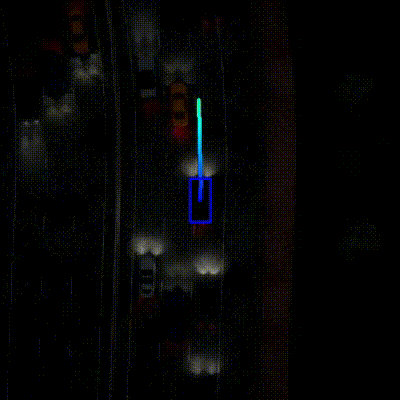</td> <td> x </td><td> The ego vehicle tries to avoid the parked vehicle, but because of inaccurate and instabe planing, it still collides against it.</td>
  </tr>  <tr>
    <td> 8</td><td>  UniAD-Base </td> <td>ParkedObstacle</td><td>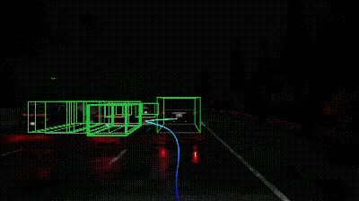</td><td>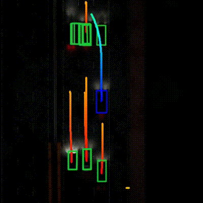</td><td> x </td><td> The ego vehicle detects the parked car, but predicts wrong trajectory, and collides against it.</td>
  </tr>
  <tr>
    <td> 9 </td><td>  VAD-Base </td> <td>ParkedObstacle</td><td>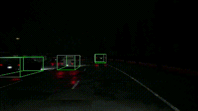</td><td>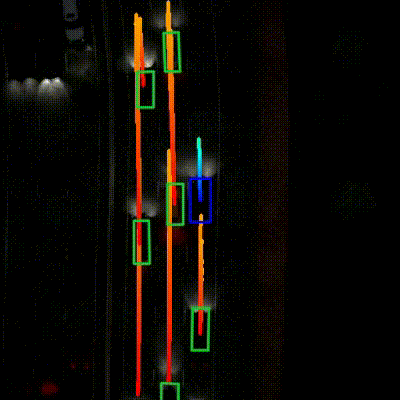</td><td> √ </td><td> The ego vehicle detects the parked car and turns left to avoid the car and cars coming behind.</td>
  </tr>
  <tr>
    <td> 10 </td><td>  TCP-traj </td> <td>HazardAtSideLane</td><td>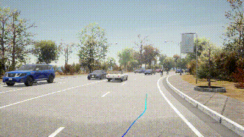</td><td></td> <td> x </td><td> The ego vehicle's behavior is confusing. It drives onto sidewalk and collides against cyclist.(the video is at x2 speed)</td>
  </tr>  
  <tr>
    <td> 11 </td><td>  UniAD-Base </td> <td>HazardAtSideLane</td><td>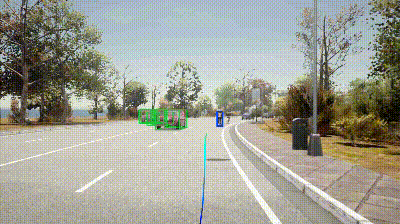</td><td></td><td> √ </td><td> The ego vehicle detects cyclists and makes a left lane change smoothly.</td>
  </tr>
  <tr>
    <td> 12 </td><td>  VAD-Base </td> <td>HazardAtSideLane</td><td>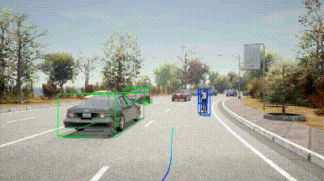</td><td></td><td> √ </td><td> The ego vehicle detects cyclists, slows down and follows them for a while, and then overtakes them through the leftside of the lane without changing lane.</td>
  </tr>

</table>

# Emergency Brake

We visualize the behavior of three models on `ParkingCutIn` and `StaticCutIn` scenarios to show their ability of emergency brake. In these scenarios, the ego must slow down or brake to allow a vehicle cut in. 

<table>
  <tr>
    <th> Case ID </th><th> Models </th> <th> Scenario </th><th>&nbsp;&nbsp;&nbsp;&nbsp;&nbsp;&nbsp;&nbsp;&nbsp;&nbsp;&nbsp;&nbsp;&nbsp;&nbsp;Front&nbsp;Camera&nbsp;&nbsp;&nbsp;&nbsp;&nbsp;&nbsp;&nbsp;&nbsp;&nbsp;&nbsp;&nbsp;&nbsp;&nbsp;</th><th>&nbsp;&nbsp;&nbsp;&nbsp;&nbsp;&nbsp;BEV&nbsp;&nbsp;&nbsp;&nbsp;&nbsp;&nbsp;</th><th>Success</th><th>Qualitatively Analysis</th>
  </tr>
  <tr>
    <td> 13 </td><td> TCP-traj </td> <td>ParkingCutIn</td><td>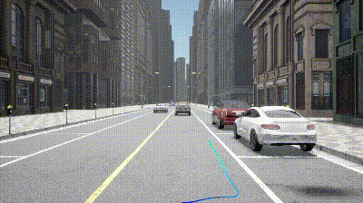</td><td></td> <td> √ </td><td> The ego vehicle brakes and waits the parked vehicle to exit.</td>
  </tr>  <tr>
    <td> 14 </td><td>  UniAD-Base </td> <td>ParkingCutIn</td><td>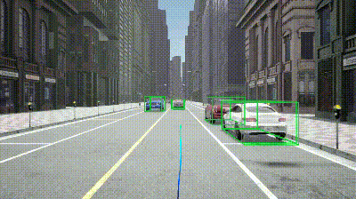</td><td></td><td> √ </td><td> The ego vehicle detects the parked vehicle, predicts its motion correctly, so the ego vehicle brakes and waits the parked vehicle to exit.</td>
  </tr>
  <tr>
    <td> 15 </td><td>  VAD-Base </td> <td>ParkingCutIn</td><td>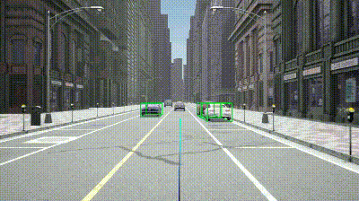</td><td></td><td> x </td><td> The ego vehicle detects the parked car but not stops, and leads to a series of collisions.</td>
  </tr>
  <tr>
    <td> 16 </td><td>  TCP-traj </td> <td>StaticCutIn</td><td>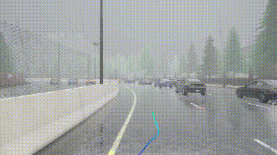</td><td>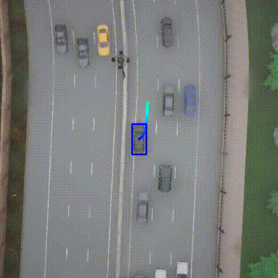</td> <td> x </td><td> The ego vehicle drives slowly. When the vehicle at front right attempt to change the lane, ego vehicle turns left unnecessaryly, which occurs collision.</td>
  </tr>  
  <tr>
    <td> 17 </td><td>  UniAD-Base </td> <td>StaticCutIn</td><td>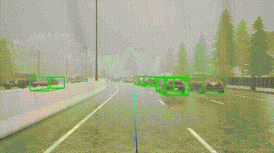</td><td>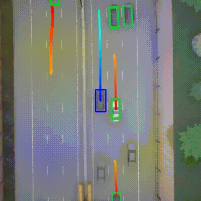</td><td> √ </td><td> The ego vehicle brakes when other vehicle cuts in.</td>
  </tr>
  <tr>
    <td> 18 </td><td>  VAD-Base </td> <td>StaticCutIn</td><td>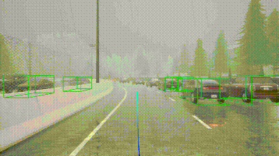</td><td>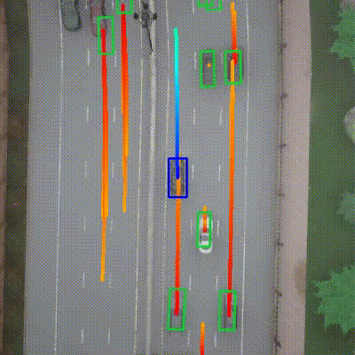</td><td> √ </td><td> The ego vehicle stops at several positions that other vehicles may cut in</td>
  </tr>

</table>

# Give Way

We visualize the behavior of three models on `YieldToEmergencyVehicle` and `InvadingTurn`  scenarios to show their ability of giving way. In `YieldToEmergencyVehicle`, ego must maneuver to allow the emergency vehicle behind to pass. In `InvadingTurn`,a vehicle coming from the opposite lane invades the ego’s lane, forcing the ego to move right to avoid a possible collision.

<table>
  <tr>
    <th> Case ID </th><th> Models </th> <th> Scenario </th><th>&nbsp;&nbsp;&nbsp;&nbsp;&nbsp;&nbsp;&nbsp;&nbsp;&nbsp;&nbsp;&nbsp;&nbsp;&nbsp;Front/Back&nbsp;Camera&nbsp;&nbsp;&nbsp;&nbsp;&nbsp;&nbsp;&nbsp;&nbsp;&nbsp;&nbsp;&nbsp;&nbsp;&nbsp;</th><th>&nbsp;&nbsp;&nbsp;&nbsp;&nbsp;&nbsp;BEV&nbsp;&nbsp;&nbsp;&nbsp;&nbsp;&nbsp;</th><th>Success</th><th>Qualitatively Analysis</th>
  </tr>
  <tr>
    <td> 19 </td><td> TCP-traj </td> <td>YieldTo Emergency Vehicle</td><td>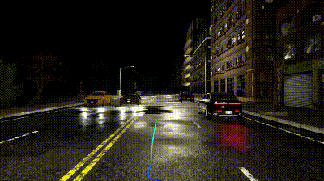 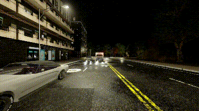</td><td>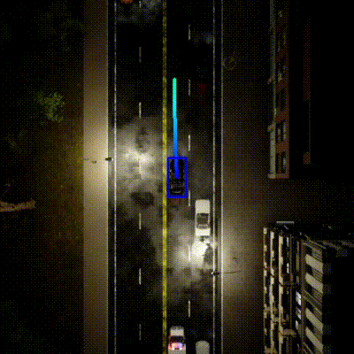</td> <td> x </td><td> TCP model does not use back cameras, so ego can not detect the emergency vehicle behind.</td>
  </tr>  <tr>
    <td> 20 </td><td>  UniAD-Base </td> <td>YieldTo Emergency Vehicle</td><td>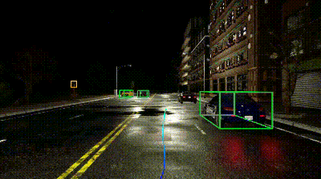 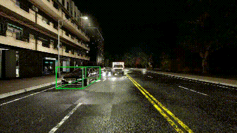</td><td>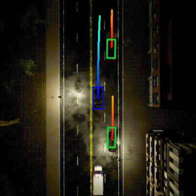</td><td> x </td><td> The ego vehicle fails to detect the emergency vehicle, and does not giveway.</td>
  </tr>
  <tr>
    <td> 21 </td><td>  VAD-Base </td> <td>YieldTo Emergency Vehicle</td><td>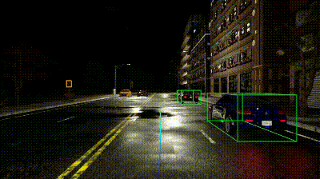 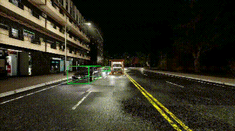</td><td>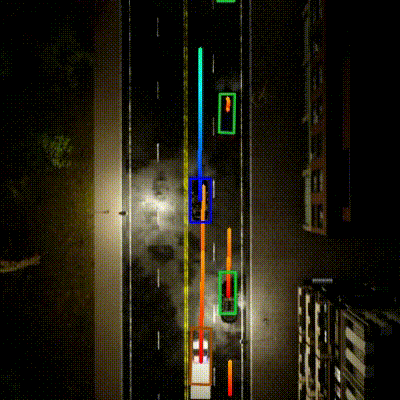</td><td> x </td><td> The ego vehicle detects the emergency vehicle and tries to move right to giveway, but collides against vehicle on right lane.</td>
  </tr>
  <tr>
    <td> 22 </td><td>  TCP-traj </td> <td>InvadingTurn</td><td></td><td>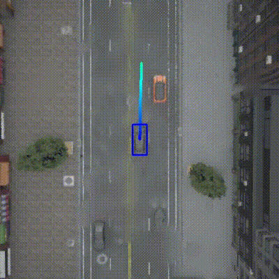</td> <td> √ </td><td> The ego vehicle drives slowly and moves right to avoid collision.</td>
  </tr>  
  <tr>
    <td> 23 </td><td>  UniAD-Base </td> <td>InvadingTurn</td><td>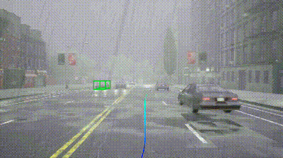</td><td>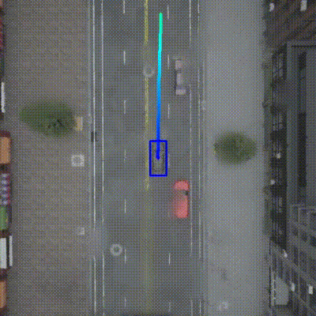</td><td> √ </td><td> The ego vehicle drives in a normal spped and moves right to avoid collision.</td>
  </tr>
  <tr>
    <td> 24 </td><td>  VAD-Base </td> <td>InvadingTurn</td><td>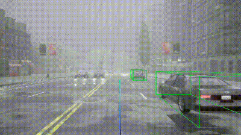</td><td>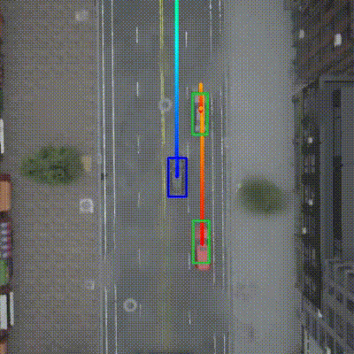</td><td> x </td><td> The ego vehicle moves too much, it invades the right lane and collides against other vehicle.</td>
  </tr>

</table>

# Traffic Sign

We visualize the behavior of three models on  `EnterActorFlow` and `VanillaNonSignalizedTurnEncounterStopsign` scenarios to show their ability of following traffic sign. In `EnterActorFlow`, ego should follow the traffic light. In `VanillaNonSignalizedTurnEncounterStopsign`, ego should stop and start at stop signs.

<table>
  <tr>
    <th> Case ID </th><th> Models </th> <th> Scenario </th><th>&nbsp;&nbsp;&nbsp;&nbsp;&nbsp;&nbsp;&nbsp;&nbsp;&nbsp;&nbsp;&nbsp;&nbsp;&nbsp;Front&nbsp;Camera&nbsp;&nbsp;&nbsp;&nbsp;&nbsp;&nbsp;&nbsp;&nbsp;&nbsp;&nbsp;&nbsp;&nbsp;&nbsp;</th><th>&nbsp;&nbsp;&nbsp;&nbsp;&nbsp;&nbsp;BEV&nbsp;&nbsp;&nbsp;&nbsp;&nbsp;&nbsp;</th><th>Success</th><th>Qualitatively Analysis</th>
  </tr>
  <tr>
    <td> 25 </td><td> TCP-traj </td> <td>EnterActorFlow</td><td>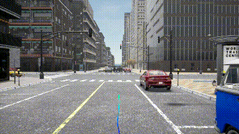</td><td></td> <td> √ </td><td> The ego vehicle follows the traffic light and goes through the junction.</td>
  </tr>  <tr>
    <td> 26 </td><td>  UniAD-Base </td> <td>EnterActorFlow</td><td>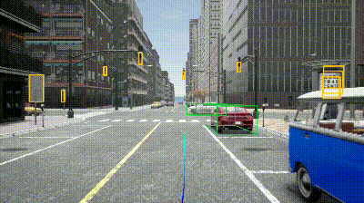</td><td>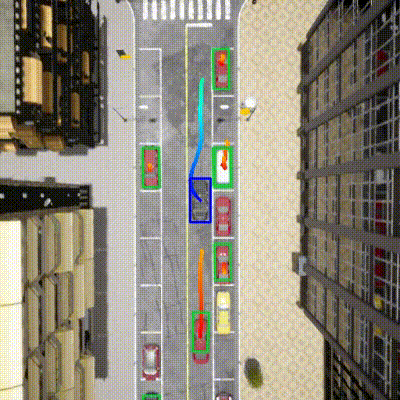</td><td> x </td><td> The ego vehicle detects the traffic light but runs a red light.</td>
  </tr>
  <tr>
    <td> 27 </td><td>  VAD-Base </td> <td>EnterActorFlow</td><td>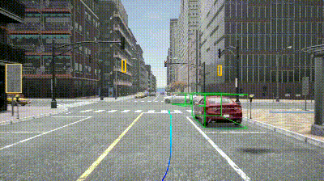</td><td>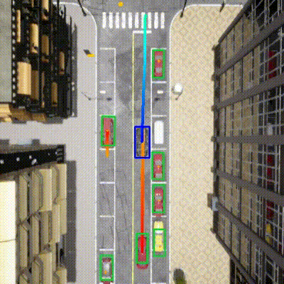</td><td>x </td><td> The ego vehicle does not detects the traffic light accurately，and runs a red light.</td>
  </tr>
  <tr>
    <td> 28 </td><td>  TCP-traj </td> <td>Vanilla NonSignalized TurnEncounter Stopsign</td><td></td><td>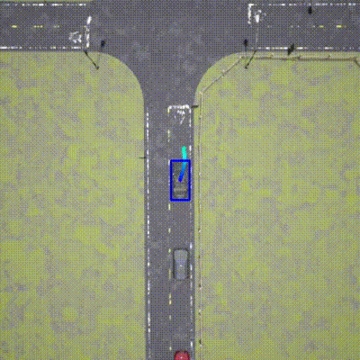</td> <td> √ </td><td> The ego vehicle stops and waits at stop sign.After the opposite vehicle passes the junction, ego goes through the junction.</td>
  </tr>  
  <tr>
    <td> 29 </td><td>  UniAD-Base </td> <td>Vanilla NonSignalized TurnEncounter Stopsign</td><td>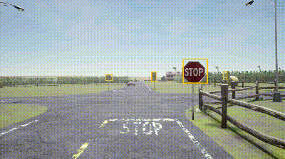</td><td>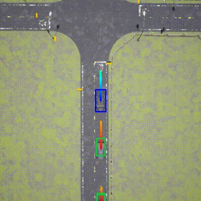</td><td> x </td><td> The ego vehicle does not stop and runs a stop.</td>
  </tr>
  <tr>
    <td> 30 </td><td>  VAD-Base </td> <td>Vanilla NonSignalized TurnEncounter Stopsign</td><td></td><td></td><td> x </td><td> The ego vehicle stops at the sign but gets blocked, does not start again.</td>
  </tr>

</table>

# Conclusion

* **Strategies:** The three E2E-AD models implement distinct strategies. The TCP model adopts a conservative approach, favoring slower speeds to enhance obstacle avoidance and response to unexpected events, potentially at the cost of traffic flow efficiency. Conversely, the VAD model employs a more aggressive strategy, increasing the risk of excessive speed and abrupt maneuvers, which could lead to collisions. The strategy of UniAD lies between these extremes.

* **Diverse Behaviors in Identical Scenarios:** It is notable that in certain scenarios, such as cases `10`, `11`, and `12`, different models trained on the same dataset exhibit varied behaviors, with more than one approach being reasonable, as seen in cases `11` and `12`.
* **Perception and Planning：** The interplay between perception and planning is critical. A model’s failure to detect nearby vehicles often leads to incorrect routing, as demonstrated in case `5`. However, even precise object detection does not always ensure correct planning decisions, as illustrated in case `10`.
* **Failure Cases nalysis:** Several factors contribute to the failure cases observed. These include the inability to perceive other vehicles (cases `5` and `20`), inaccurate motion predictions (case `8`), actions that are either too mild (case `7`) or too forceful (case `24`), and misinterpretations of the scene (cases `29` and `30`).